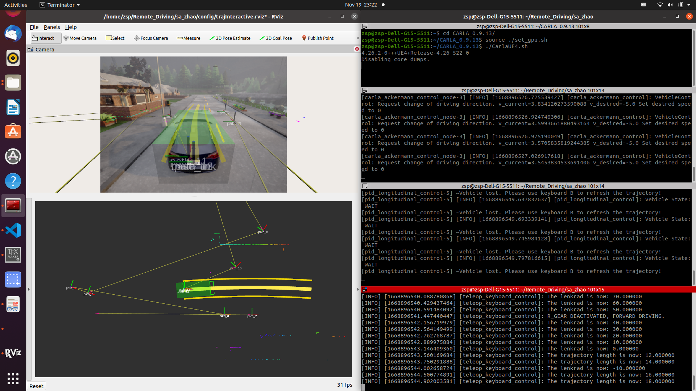

# SA_Zhao

## Brief Introduction
This is a github repository developed by Zhao, Shupeng under the guidance of Florain,Pfab. It contains the code of the semseter thesis "Implementation of a Trajectory-based Control for Teleoperated Road Vehicles".

## Architecture
Two branches are really meaningful in this repositpry:  
1.**main**: only contains several pacakages to make an interactive trajectory by keyboard. It is a small game which you need to plan a smooth trajecptory from a staring pose to an ending pose. You can play with it and get familiar with this software. Only a ros2 environment is needed😛.  
  

2.**purepursuit_ackermann_control**:
A Branch that contains interactive path planning and control.  
  

## Code explaination
The packages in the purepursuit_ackermann can be seperated into four groups:  
### 1 Carla refitted:
Program:  
**carla_ackermann_control**  
**carla_common**  
**carla_ros_bridge**  
**carla_spawn_objects**  
**ros_compatibility**  
APIs:  
**carla_msgs**  
**carla_ackermann_msgs**  

### 2 Autoware refitted:
Program:  
**autoware_cmake**  
**vehicle_info_util**  
APIs:  
**autoware_auto_control_msgs**  
**autoware_auto_planning_msgs**  
**autoware_auto_vehicle_msgs**  

### 3 Tod refitted
Program:  
**tod_input_devices**  
**tod_command_creation**  
APIs:  
**tod_msgs**  

### 4 Original developed
Program:  
**interactive_trajectory**  
**random_trajectory**  
APIs:  
**traj_interfaces**  

## User guidance
1 colcon build and source the install/setup.bash  
2 Start CarlaUE4 simulator  

### For the Keyboard control
3 Open a terminal: ros2 launch interactive_trajectory carla.launch.py  
4 Open another terminal: ros2 launch interactive_trajectory tele_driving_keyboard.launch.py  
5 Open another termanal: ros2 run interactive_trajectory auto_teleop_key  

### For the Fanatec contorl  
3 Open a terminal: ros2 launch interactive_trajectory carla.launch.py  
4 Open another terminal: ros2 launch interactive_trajectory tele_driving_fanatec.launch.py  
5 Open another termanal: ros2 run interactive_trajectory fanatec.launch.py  

Then you can control the vehicle to drive in the carla simulation environments using trajectory commands.

## Paramters adujustment
You can adjust the parameters for two controllers, the longitudinal PID control and the horizontal pure pursuit control under the .yaml config file in the package interactive_trajectory. Or you can adjust them during running.

